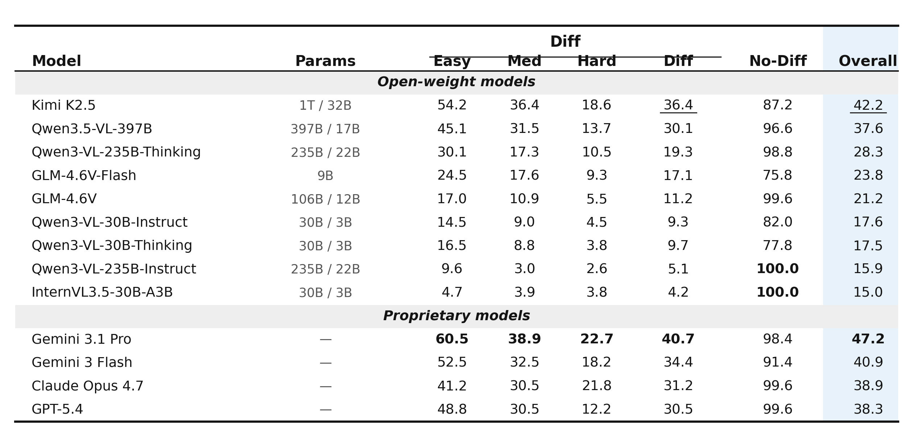

<div align="center">


### Can VLMs Spot Fine-Grained Visual Differences in Web Interfaces?

<br>

<p>
<a href="https://huggingface.co/datasets/tencent/DiffSpot"></a>
&nbsp;
<a href="LICENSE"></a>
&nbsp;

</p>

<br>

<table>
<tr>
<td>
<h3>🏆 Across 13 frontier VLMs evaluated zero-shot, even the best identifies only <b>40.7%</b> of true changes — and Hard-tier recall stays below <b>23%</b> for <i>every</i> model.</h3>
</td>
</tr>
</table>

</div>

<br>

**DiffSpot** is a benchmark for **fine-grained visual change detection in real-world web interfaces**. Each example is a pair of near-identical screenshots that differ by a single programmatic CSS-level mutation; a VLM must describe **what changed**. Ground truth is recorded directly from the mutation that produced the pair.

> [!NOTE]
> The dataset is hosted on HuggingFace at [`tencent/DiffSpot`](https://huggingface.co/datasets/tencent/DiffSpot). This repository ships the full evaluation stack — judge, metrics, baseline runners, CI, and tests. The test suite (`pytest -v tests/`) exercises the eval pipeline against synthetic data, with no API key or dataset download required.

---

## ✨ Highlights

- **A clean probe for fine-grained perception.** VLMs ace high-level image–text alignment but stumble on localized UI changes — DiffSpot isolates exactly that ability on real web interfaces.
- **Hard and unsolved.** The best of 13 frontier VLMs reaches only **40.7%** recall, and Hard-tier recall stays **below 23% for every model**.
- **Difficulty is property-dependent.** Neither pixel magnitude nor CLIP distance predicts recall — the bottleneck is *nameability*, not visual salience.
- **Controllable by construction.** A fully code-driven pipeline (mutate one CSS property → re-render → record) yields exact ground truth on a tunable difficulty gradient, with a grounding gate that discards no-effect and reflow-contaminated pairs.
- **Honest evaluation.** Open-ended description (not multiple choice), plus a 500-pair no-diff control that directly exposes hallucination.

---

## 🏆 Leaderboard

<div align="center">

</div>

**Easy / Med / Hard / Diff** are Recall on the has-diff pairs (1,300 per tier; 3,900 total); **No-Diff** is specificity on the 500 control pairs; **Overall** is per-case accuracy `(TP + TN) / 4,400` — the official score. Judge: `gpt-oss-120b`, `reasoning_effort=high` (cross-judge Kendall τ = 1.000 across gpt-oss-120b / Kimi-K2.5 / Qwen3.5-VL-397B). **Bold** = column max; <u>underline</u> = best open-weight. Trivial always-no-diff baseline: 11.4% Overall.

> [!TIP]
> Gemini 3.1 Pro leads at **47.2%**, 5.0 pp ahead of the best open-weight model (Kimi K2.5, 42.2%). Seven of thirteen models fall below 30%. Difficulty is strongly property-dependent — across CSS operators, neither pixel magnitude nor CLIP distance reliably predicts recall.

Submit your model: see [`docs/submission.md`](docs/submission.md).

---

## 🚀 Quick Start

```bash
git clone https://github.com/Tencent/DiffSpot.git
cd DiffSpot
pip install -e ".[api]"

export OPENAI_API_KEY=...   # for both the baseline run and the judge

# 1. Run a baseline VLM (loads the HF dataset, writes predictions JSONL)
python baselines/api/run_openai.py \
    --model gpt-5.4 \
    --output results/gpt-5.4/predictions.jsonl

# 2. Score predictions with the official LLM judge (gpt-oss-120b)
python scripts/evaluate.py \
    --predictions results/gpt-5.4/predictions.jsonl \
    --judge-model gpt-oss-120b \
    --output results/gpt-5.4/scores.json

# 3. Print the official metrics table
python scripts/show_results.py results/gpt-5.4/scores.json
```

> [!TIP]
> To target an OpenAI-compatible endpoint (vLLM, sglang, an internal gateway) for the judge, set `OPENAI_BASE_URL`. Anthropic / Google baselines use `ANTHROPIC_API_KEY` / `GOOGLE_API_KEY`.

---

## 🗂️ Repository Layout

```
DiffSpot/
├── diffspot/              # Core package (data loader, judge, metrics)
│   └── prompts/           # VLM and judge prompt templates (versioned)
├── baselines/             # Reference baseline runners
│   ├── api/               # API-hosted models (OpenAI / Anthropic / Google)
│   └── local/             # Self-hosted models via sglang / vllm
├── scripts/               # End-to-end CLIs (eval, metrics, submission prep)
├── docs/                  # Data card, evaluation protocol, submission guide
├── examples/              # Sample predictions + walkthrough
├── results/               # Per-model raw predictions + scores (reproducibility)
├── leaderboard/           # Machine-readable leaderboard + auto-update tooling
└── space/                 # HuggingFace Space demo source
```

---

## 📚 Citation

```bibtex
@article{diffspot2026,
  title  = {DiffSpot: Can VLMs Spot Fine-Grained Visual Differences in Web Interfaces?},
  author = {TBD},
  year   = {2026},
  note   = {arXiv preprint TBD}
}
```

---

## 📄 License

DiffSpot-Bench (code and dataset) is released under the **MIT License** — see [`LICENSE`](LICENSE). Copyright (C) 2026 Tencent. All rights reserved.
