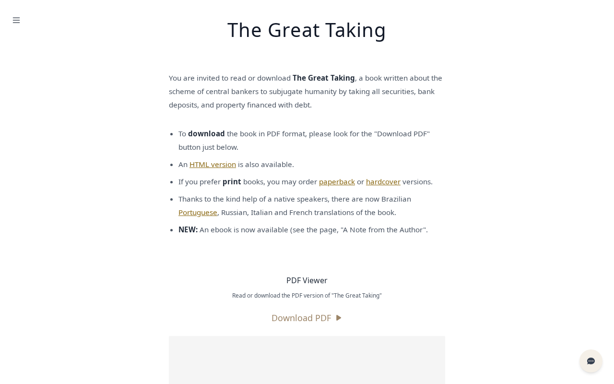
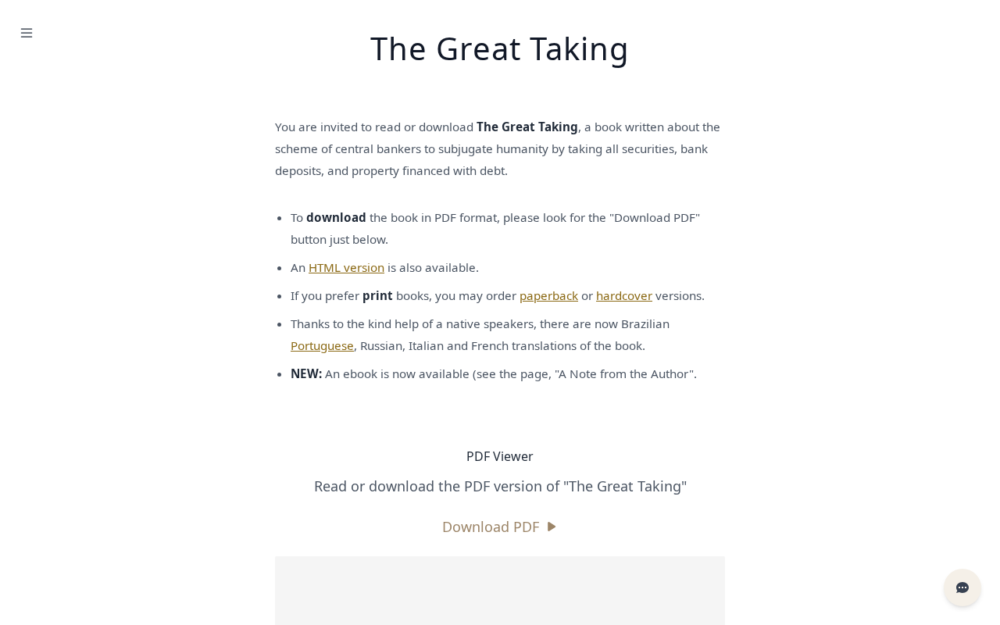
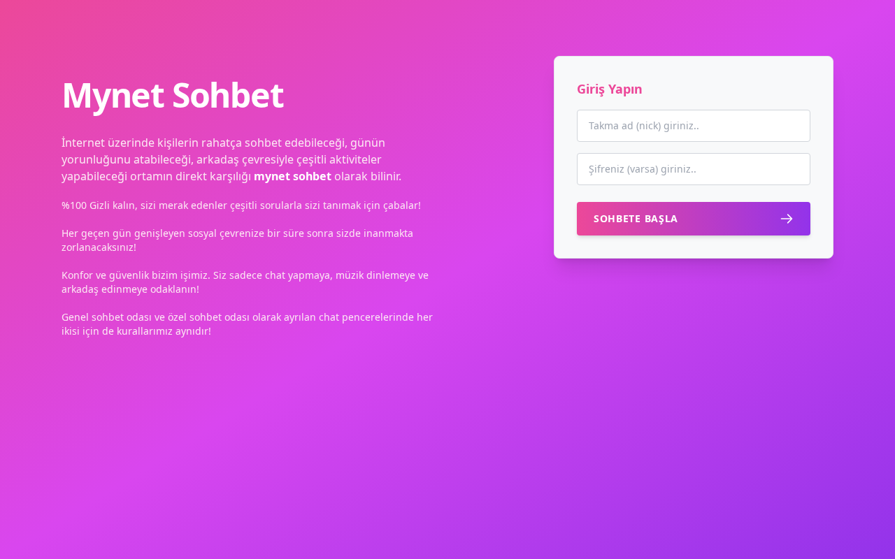
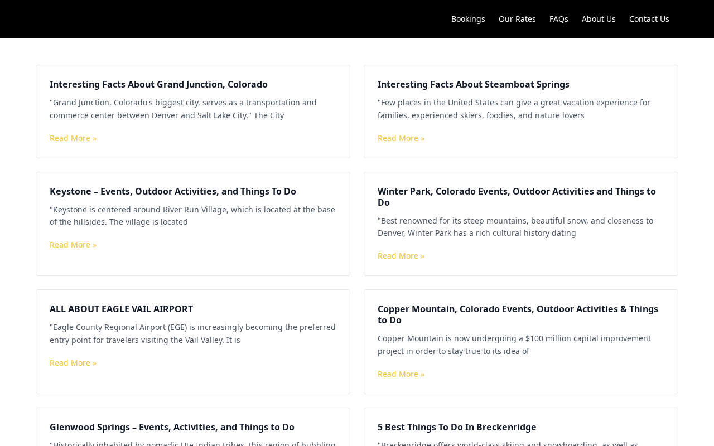
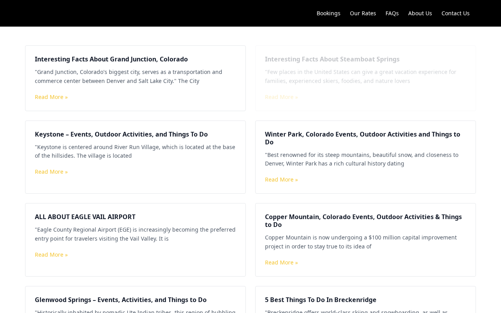
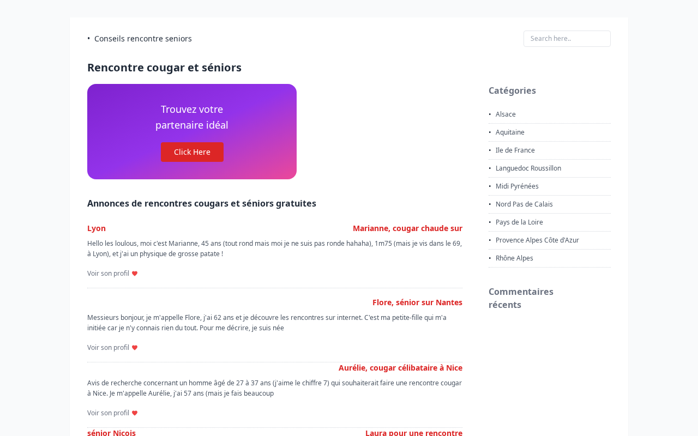
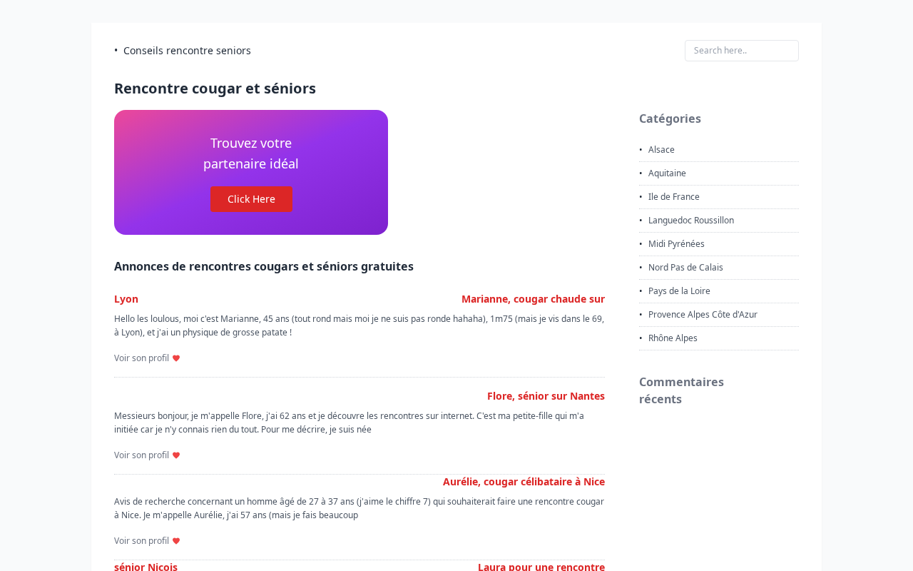
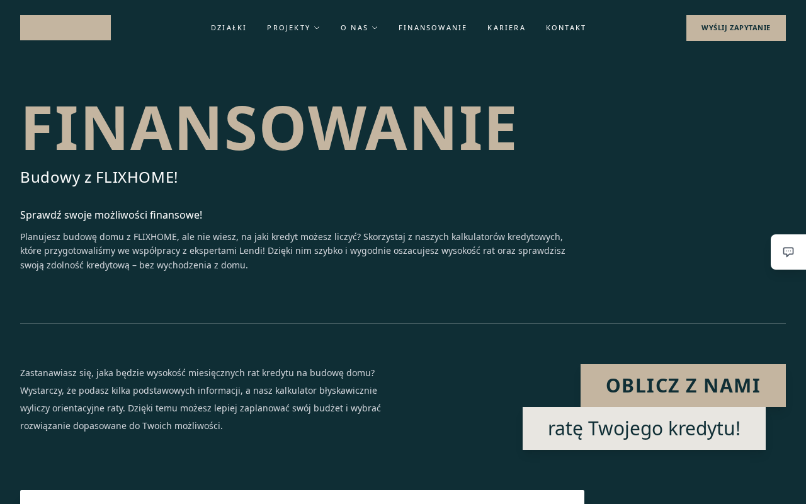
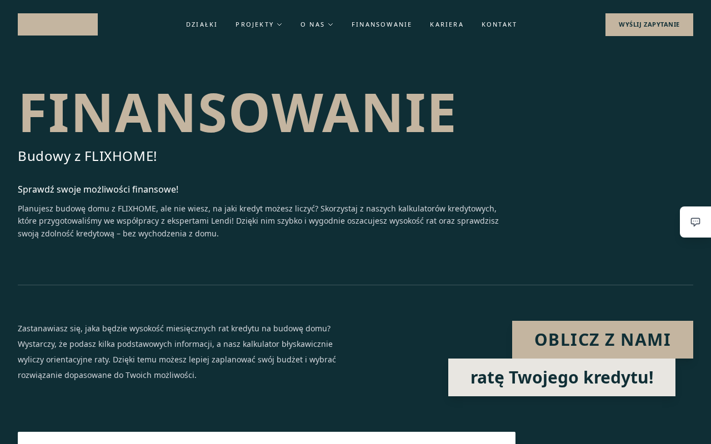

<div align="center">


## Can VLMs Spot Fine-Grained Visual Differences in Web Interfaces?

#### WeChat AI

<br>

<p>
<a href="https://huggingface.co/datasets/tencent/DiffSpot"></a>
&nbsp;
<a href="LICENSE"></a>
&nbsp;
<a href=""></a>
</p>

</div>

<br>

**DiffSpot** is a benchmark for **fine-grained visual change detection in real-world web interfaces**. Each example is a pair of near-identical screenshots that differ by a single programmatic CSS-level mutation; a VLM must describe **what changed**. Ground truth is recorded directly from the mutation that produced the pair.

---

## ✨ Highlights

- **A clean probe for fine-grained perception.** VLMs ace high-level image–text alignment but stumble on localized UI changes — DiffSpot isolates exactly that ability on real web interfaces.
- **Difficulty is property-dependent.** Neither pixel magnitude nor CLIP distance predicts recall — the bottleneck is *nameability*, not visual salience.
- **Controllable by construction.** A fully code-driven pipeline (mutate one CSS property → re-render → record) yields exact ground truth on a tunable difficulty gradient, with a grounding gate that discards no-effect and reflow-contaminated pairs.

---

## 👀 Example Pairs

Each pair differs by a single CSS-level mutation. The model is given both screenshots and must name the change.

<table>
<tr><th width="50%">Before</th><th width="50%">After</th></tr>
<tr>
  <td></td>
  <td></td>
</tr>
<tr><td colspan="2" align="center"><sub>The caption under the "PDF Viewer" heading is slightly larger.</sub></td></tr>
<tr>
  <td></td>
  <td></td>
</tr>
<tr><td colspan="2" align="center"><sub>The "SOHBETE BAŞLA" button has more rounded corners.</sub></td></tr>
<tr>
  <td></td>
  <td></td>
</tr>
<tr><td colspan="2" align="center"><sub>The card with the heading "Interesting Facts About Steamboat Springs" is much more transparent.</sub></td></tr>
<tr>
  <td></td>
  <td></td>
</tr>
<tr><td colspan="2" align="center"><sub>The banner background showing the "Find your ideal partner" tagline now uses a different gradient.</sub></td></tr>
<tr>
  <td></td>
  <td></td>
</tr>
<tr><td colspan="2" align="center"><sub>The subtitle "your loan installment!" in the financing section is slightly bolder.</sub></td></tr>
</table>

---

## 🏆 Leaderboard

<div align="center">

</div>

**Easy / Med / Hard / Diff** are Recall on the has-diff pairs (1,300 per tier; 3,900 total); **No-Diff** is specificity on the 500 control pairs; **Overall** is per-case accuracy `(TP + TN) / 4,400` — the official score. Judge: `gpt-oss-120b`, `reasoning_effort=high` (cross-judge Kendall τ = 1.000 across gpt-oss-120b / Kimi-K2.5 / Qwen3.5-VL-397B). **Bold** = column max; <u>underline</u> = best open-weight. Trivial always-no-diff baseline: 11.4% Overall.

> [!TIP]
> Gemini 3.1 Pro leads at **47.2%**, 5.0 pp ahead of the best open-weight model (Kimi K2.5, 42.2%). Seven of thirteen models fall below 30%. Difficulty is strongly property-dependent — across CSS operators, neither pixel magnitude nor CLIP distance reliably predicts recall.

Submit your model: see [`docs/submission.md`](docs/submission.md).

---

## 🚀 Quick Start

```bash
git clone https://github.com/Tencent/DiffSpot.git
cd DiffSpot
pip install -e ".[api]"

export OPENAI_API_KEY=...   # for both the baseline run and the judge

# 1. Run a baseline VLM (loads the HF dataset, writes predictions JSONL)
#    Replace gpt-5.4 with your own model — see "Evaluate your own model" below.
python baselines/api/run_openai.py \
    --model gpt-5.4 \
    --output results/gpt-5.4/predictions.jsonl

# 2. Score predictions with the official LLM judge (gpt-oss-120b)
python scripts/evaluate.py \
    --predictions results/gpt-5.4/predictions.jsonl \
    --judge-model gpt-oss-120b \
    --output results/gpt-5.4/scores.json

# 3. Print the official metrics table
python scripts/show_results.py results/gpt-5.4/scores.json
```

> [!TIP]
> To target an OpenAI-compatible endpoint (vLLM, sglang, an internal gateway) for the judge, set `OPENAI_BASE_URL`. Anthropic / Google baselines use `ANTHROPIC_API_KEY` / `GOOGLE_API_KEY`.

---

## 📦 Dataset

```python
from datasets import load_dataset

ds = load_dataset("tencent/DiffSpot", split="test")   # 4,400 pairs
ex = ds[0]
ex["image_before"], ex["image_after"]   # PIL.Image — before / after, in this order
ex["task_type"]                          # "visual_diff" | "no_diff"
ex["difficulty"]                         # easy | medium | hard | no_diff
ex["ground_truth_diff"]                  # natural-language GT (display only)
ex["mutation_dicts_json"]                # JSON-encoded structured GT (scoring source)
```

Other per-pair fields: `mutation_types`, `domain`, `pixel_diff` / `target_diff` / `outside_diff`, `target_bbox_{x,y,w,h}`. Offline / local parquet: `diffspot.data.load(dataset_path="path/to/test-*.parquet")`.

---

## 🧪 Evaluate your own model

The contract is simple: produce a **predictions JSONL** using the prompts in
[`diffspot/prompts/`](diffspot/prompts/) **verbatim**, then score it. Copy a runner in
[`baselines/`](baselines/) (`api/` or `local/`) as a template and swap in your model client.

> [!IMPORTANT]
> Two things silently wreck scores if you roll your own runner:
> - **Image order** — feed `image_before` first, `image_after` second (the prompt is anchored to "Image 1 = before, Image 2 = after").
> - **`max_tokens` ≥ 16384** at `temperature 0`. A thinking model on a small budget spends it on hidden reasoning and returns empty `content` → parse failures, not errors.

Predictions JSONL — one record per pair:

```json
{"id": "...", "split": "easy|medium|hard|no_diff", "model": "...", "prompt_version": "v1.0", "prediction": "<model's free-form diff list>"}
```

Runners **resume automatically** (re-running continues from where they stopped). Validate before submitting:

```bash
python scripts/prepare_submission.py --predictions results/<model>/predictions.jsonl --output submissions/<model>.zip
```

**Scoring** uses the official judge `gpt-oss-120b` (`reasoning_effort=high`), two ways:

- **Self-evaluate** — the judge is open-weight; host it (vLLM / sglang) or point `OPENAI_BASE_URL` at any OpenAI-compatible endpoint serving it, then run `scripts/evaluate.py` (Quick Start step 2).
- **Don't want to host a 120B judge?** Submit only your predictions and we score them — see [`docs/submission.md`](docs/submission.md).

Metric definitions (Overall / Diff / No-Diff, and why No-Diff specificity matters): [`docs/evaluation.md`](docs/evaluation.md).

---

## ⚙️ Environment Variables

| Variable | Used by |
|---|---|
| `OPENAI_API_KEY` | OpenAI baseline **and** the judge |
| `OPENAI_BASE_URL` | route the OpenAI client to a vLLM / sglang / gateway endpoint (judge or self-hosted models) |
| `ANTHROPIC_API_KEY` | Anthropic baseline |
| `GOOGLE_API_KEY` (or `GEMINI_API_KEY`) | Google baseline |

Requires Python ≥ 3.10. `pip install -e ".[api]"` pulls the API clients; self-hosted models in `baselines/local/` expect an OpenAI-compatible endpoint (`--endpoint`).

---

## 🗂️ Repository Layout

```
DiffSpot/
├── diffspot/              # Core package (data loader, judge, metrics)
│   └── prompts/           # VLM and judge prompt templates (versioned)
├── baselines/             # Reference baseline runners
│   ├── api/               # API-hosted models (OpenAI / Anthropic / Google)
│   └── local/             # Self-hosted models via sglang / vllm
├── scripts/               # End-to-end CLIs (eval, metrics, submission prep)
├── docs/                  # Data card, evaluation protocol, submission guide
├── examples/              # Sample predictions + walkthrough
├── results/               # Per-model raw predictions + scores (reproducibility)
├── leaderboard/           # Machine-readable leaderboard + auto-update tooling
└── space/                 # HuggingFace Space demo source
```

---

## 📚 Citation

```bibtex
@article{diffspot2026,
  title  = {DiffSpot: Can VLMs Spot Fine-Grained Visual Differences in Web Interfaces?},
  author = {TBD},
  year   = {2026},
  note   = {arXiv preprint TBD}
}
```

---

## 📄 License

DiffSpot-Bench (code and dataset) is released under the **MIT License** — see [`LICENSE`](LICENSE). Copyright (C) 2026 Tencent. All rights reserved.
